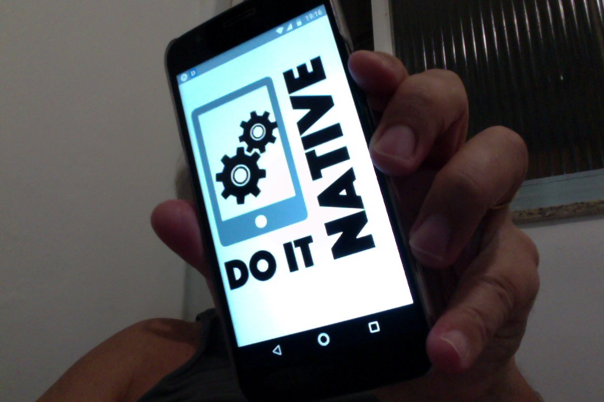
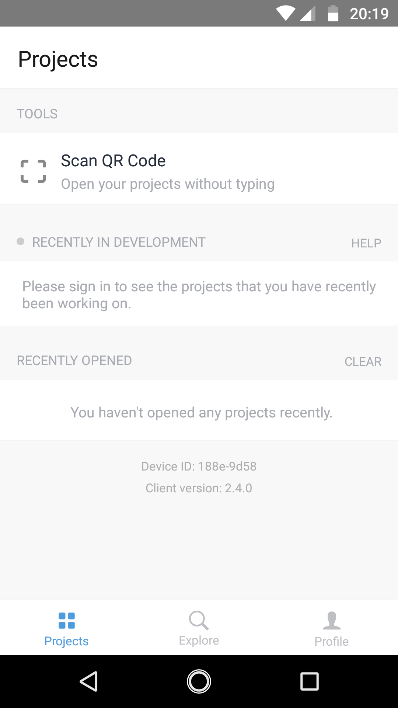

(c) 2018 [**Cleuton Sampaio**](https://github.com/cleuton).

# Dando a partida

Bom, você já criou apps móveis? Android? iOS? Não? Então, aprenderá da maneira mais simples possível. Se já criou, sabe o **inferno** que é usar **Android Studio** ou **Xcode** não? Com o **React Native** você pode utilizar a IDE que desejar, como o **Visual Studio Code**, por exemplo. E nem precisa instalar **SDK** algum em sua máquina. 

Vamos criar uma app Muuuuuiiiiiiito simples. 


Juro! É só isso mesmo!

## Instalando a parada toda

É claro que você tem que ter o **Node.js** e o **npm** instalados. Mas calma: 

*Há um bug no React Native que dá problema com o npm 5 ou superior*

Para fazer esse tutorial, eu instalei o **Node.js** versão 7.0.0, que vem com o **npm** 3.4, e tudo funcionou bem. Se não quiser ter problemas, instale o [**nvm**](http://udgwebdev.com/nvm-node-version-manager/) que você pode ter várias versões do **Node.js** em sua máquina selecionando-as com o comando: 
```
nvm use vx.y.z
```
Bom, se já resolveu o problema do **Node.js** então é só instalar a app [**create-react-native-app**](https://github.com/react-community/create-react-native-app): 
```
npm install -g create-react-native-app
```
Pronto! Acabou!

## Android Studio e Xcode?

Cara, se quiser desenvolver apps é só isso mesmo! Não precisa de mais nada. É claro que, se você quiser integrar sua app com código nativo ou com outras apps já criadas, vai necessitar do Android Studio ou do Xcode, mas isso veremos depois.

## Criando sua primeira app

É bom você instalar o [**watchman**](https://facebook.github.io/watchman/docs/install.html), que é uma app do Facebook para atualizar o dispositivo móvel a cada mudança no seu código, especialmente se você usa **MacOS**: 
```
brew install watchman
```
Bom, certifique-se de estar utilizando o **npm** com versão menor que 5! Abra um terminal e digite: 
```
create-react-native-app native1
cd native1
```
Ou então, clone este projeto da pasta **native1**. Se clonar o projeto, então terá que regerar a pasta **node_modules** com o comando: 
```
cd native1
npm install
```
Pronto! a app está criada. Se analisarmos a estrutura, é realmente mais simples que uma app **React** web: 
```
-rw-r--r--  1 cleuton  staff     306 25 Abr 16:05 App.js
-rw-r--r--  1 cleuton  staff     228 25 Abr 11:28 App.test.js
-rw-r--r--  1 cleuton  staff    1304 25 Abr 19:27 README.md
-rw-r--r--  1 cleuton  staff      47 25 Abr 11:28 app.json
-rw-r--r--  1 cleuton  staff     629 25 Abr 17:43 package.json
```
Sua app está TODA dentro do arquivo **App.js**. É claro que há mais pastas geradas, inclusive a pasta **node_modules** mas geralmente não nos preocupamos com elas.

Vamos modificar o arquivo **App.js** para ficar assim: 
```
import React, { Component } from 'react';
import { AppRegistry, Image } from 'react-native';

export default class Bananas extends Component {
  render() {
    return (
      <Image source={require('../doitnative.png')} style={{flex: 1,width: null,height: null,resizeMode: 'contain'}}/>
    );
  }
}
```
Se você fez o [meu tutorial de React](http://reactdontpanic.com), então sabe que estamos criando um Componente que retorna **JSX**. Só que os componentes retornados pelo **JSX** não são baseados em HTML 5, mas em componentes de apps móveis. Neste caso é uma [**Image React native**](https://facebook.github.io/react-native/docs/image.html).

O atributo **source** designa a **URI** da imagem, que pode ser interna ou externa. Neste caso, como estou usando uma imagem interna, informei o comando "require" dentro da expressão. E criei uma [**stylesheet**](https://facebook.github.io/react-native/docs/image.html#style) embutida, para colocar o bitmap inteiro na imagem, sem alargar e sem cortar. 

Se você importou o diretório **native1** então já tem a imagem "doitnative.png", caso contrário acrescente essa imagem. Modifique o **path** dentro da função **require()** para apontar para onde você colocou a imagem. Se simplesmente clonou o projeto, então a imagem já está no lugar correto.

Agora, execute o comando: 
```
npm start
```
Você notará que aparece um **QRCode** na tela. Você irá fotografá-lo com seu **smartphone**. 

## No seu smartphone

Instale a app **Expo** em seu [**Android**](https://play.google.com/store/apps/details?id=host.exp.exponent&hl=pt_BR) ou [**iOS**](https://itunes.apple.com/us/app/expo-client/id982107779?mt=8).

Abra o programa "expo": 


E toque onde diz: **Scan QRCode** apontando para o QRcode no terminal.

Pronto! Se tudo estiver ok, você verá o Logo deste blog.

## Mas... E o resto?

Calma! Vamos vendo aos poucos. Não se preocupe! Eu te mostrarei todos os passos para desenvolver uma app completa.